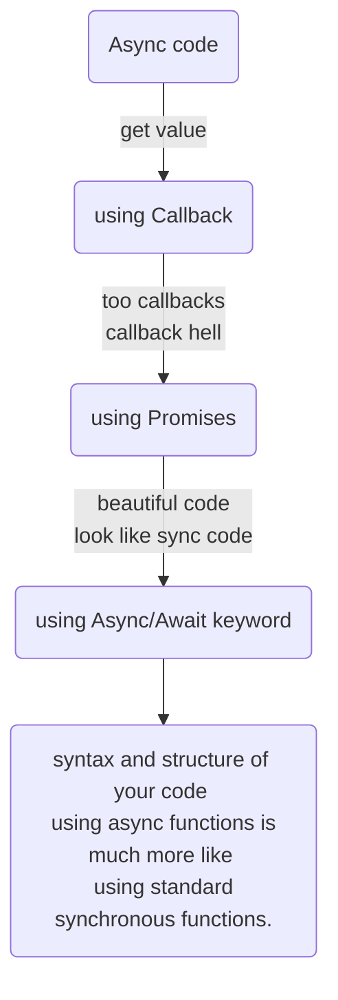
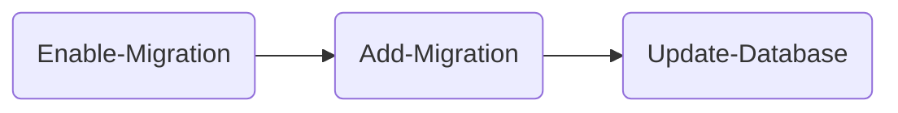

# Daily Notes - Uncategorized topic

## Simple Real Time App Architecture

You can create a simple real time app in less than one hour. 

Using something like this:

1. Using Firebase's FireStore to store data. The data will be automatically updated after any change on database
2. Using Firebase's Cloud Function to call api in somewhere. Don't care about server, host...
3. Using NodeJs, Angular, React, whatever you prefer to create simple client app


> *Instead using Google Firebase, you can use Microsoft Azure (Notification Hub, CosmosDB, Azure Function)*

*Reference*

[Real Time scraping using Puppeteer](https://medium.com/stink-studios/real-time-scraping-using-puppeteer-40495b5fc270)


## Best practices for a clean and performance Angular application

https://www.freecodecamp.org/news/best-practices-for-a-clean-and-performant-angular-application-288e7b39eb6f/

### Clean up subscriptions

When subscribing to observables, always make sure you unsubscribe from them appropriately by using operators like take, takeUntil, etc.

**Why?**

Failing to unsubscribe from observables will lead to unwanted memory leaks as the observable stream is left open, potentially even after a component has been destroyed / the user has navigated to another page.

Even better, make a lint rule for detecting observables that are not unsubscribed.

**Before**

```typescript
iAmAnObservable
    .pipe(
       map(value => value.item)     
     )
    .subscribe(item => this.textToDisplay = item);
```

**After**

Using `takeUntil` when you want to listen to the changes until another observable emits a value:

```typescript
private _destroyed$ = new Subject();

public ngOnInit (): void {
    iAmAnObservable
    .pipe(
       map(value => value.item),
       take(1),
       // We want to listen to iAmAnObservable until the component is destroyed,
       takeUntil(this._destroyed$)
     )
    .subscribe(item => this.textToDisplay = item);
}

public ngOnDestroy (): void {
    this._destroyed$.next();
    this._destroyed$.complete();
}

```

Using a private subject like this is a pattern to manage unsubscribing many observables in the component.

> Note the usage of `takeUntil` with take here. This is to avoid memory leaks caused when the subscription hasn’t received a value before the component got destroyed. Without `takeUntil` here, the subscription would still hang around until it gets the first value, but since the component has already gotten destroyed, it will never get a value — leading to a memory leak.


## How difference between `Rather than` and `Other than`?
Rather than is like saying instead of

    The food was cooked with flame rather than electric heat

Other than is like saying except or except for

    He said he doesn't own any property other than his home

I'm sorry I'm not better with technical definitions...😬

## Dom Api

But it’s still verbose!

If you are still worried about extra keystrokes you can alias both methods:
```javascript
    const $ = document.querySelector.bind(document);
    $('#container');

    const $$ = document.querySelectorAll.bind(document);
    $$('p');
```

### MutationObserver 

You can observe changes to any DOM node through the MutationObserver interface. This includes text changes, nodes being added to or removed from the observed node or changes to the node’s attributes.

The MutationObserver is an incredibly powerful API to observe virtually any change that occurs on a DOM element and its child nodes.

A new MutationObserver is created by calling its constructor with a callback function. This callback will be called whenever a change occurs on the observed node:

    const observer = new MutationObserver(callback);


**Reference**

[Using the DOM like a Pro](https://itnext.io/using-the-dom-like-a-pro-163a6c552eba)


## [JavaScript Module Pattern Basics](https://coryrylan.com/blog/javascript-module-pattern-basics)

The Module Pattern is one of the most common design patterns used in JavaScript and for good reason. 

The module pattern is easy to use and creates encapsulation of our code. 

Modules are commonly used as singleton style objects where only one instance exists. The Module Pattern is great for services and testing/TDD. 

**Creating a module**

```javascript
(function() {
  'use strict';
  // Your code here
  // All function and variables are scoped to this function
}());
```

This pattern is well known as a Immediately Invoked Function Expression or IIFE. 

**Exporting our module**

```javascript
    var myModule = (function(globalVariable) {
    'use strict';

    var _privateProperty = 'Hello World';
    var publicProperty = 'I am a public property';

    function _privateMethod() {
        console.log(_privateProperty);
    }

    function publicMethod() {
        _privateMethod();
    }
        
    return {
        publicMethod: publicMethod,
        publicProperty: publicProperty
    };
    }(globalVariable));
    
    myModule.publicMethod();    		        // outputs 'Hello World'   
    console.log(myModule.publicProperty);       // outputs 'I am a public property'
    console.log(myModule._privateProperty);     // is undefined protected by the module closure
    myModule._privateMethod();                  // is TypeError protected by the module closure

```

## Thumb Rules for async-await and promise in javascript

> Innovation: Async code -> Callback -> Promises -> Async/Await keyword



> The purpose of `async/await` functions is to simplify the behavior of using promises synchronously and to perform some behavior on a group of Promises. Just as `Promises` are similar to structured callbacks, async/await is similar to combining generators and promises.

**Promise**

1. Use promises whenever you are using asynchronous or blocking code.
2. `resolve` maps to then and `reject` maps to catch for all practical purposes.
3. Make sure to write both `.catch` and `.then` methods for all the promises.

**async-await**

1. `async` functions return a promise
2. `async` functions use an implicit `Promise` to return results. Even if you don’t return a promise explicitly, the `async` function makes sure that your code is passed through a promise.
3. `await` blocks the code execution within the async function, of which it
4. Be extra careful when using await within loops and iterators. You might fall into the trap of writing sequentially-executing code when it could have been easily done in parallel.
5. `await` only blocks the code execution within the async function. It only makes sure that the next line is executed when the promise resolves. So, if an asynchronous activity has already started, await will not have any effect on it.

**Should I Use Promises or async-await**
1. The async function returns a promise. The converse is also true. Every function that returns a promise can be considered as async function.
2. await blocks the execution of the code within the async function in which it is located.
3. If two functions can be run in parallel, create two different async functions and then run them in parallel.
4. To run promises in parallel, create an array of promises and then use `Promise.all(promisesArray)`.
5. Every time you use await remember that you are writing blocking code.
6. If your code contains blocking code, it is better to make it an async function. By doing this, you are making sure that somebody else can use your function asynchronously.
7. By making async functions out of blocking code, you are enabling the user (who will call your function) to decide on the level of asynchronicity they want.

> It’s not necessary to use promise.all, with async/await. The equivalent is something like:

> `const allOfThem = [await promise1, await promise2, …];`

> Note: the above code assumes that you have already assigned the promises to a constant or variable (e.g. promise1) and did not call an async function within the array literal (e.g. `[await getPromise(), await getP2()])`, as the second item would not kick off the code to retrieve anything until the first was done.

Source:

[JavaScript: Promises or async-await](https://medium.com/better-programming/should-i-use-promises-or-async-await-126ab5c98789)

**async functions return a promise**

Now that you’ve seen the benefit of Async/Await, let’s discuss some smaller details that are important to know. First, anytime you add async to a function, that function is going to implicitly return a promise.

```javascript
async function getPromise(){}

const promise = getPromise()
```

Even though getPromise is literally empty, it’ll still return a promise since it was an async function.

If the async function returns a value, that value will also get wrapped in a promise. That means you’ll have to use .then to access it.

```javascript
async function add (x, y) {
  return x + y
}

add(2,3).then((result) => {
  console.log(result) // 5
})
```

Let try with Promise, async-await, how await block the code to the next line is executed


```javascript

function resolveWithPromise() {
  return new Promise(resolve => {
      resolve('resolved of promises');
  });
}

async function resolveWithAsync() {
  return "resolved of async";
}

async function asyncCall() {
  console.log('calling');
  
  //await console 1
  console.log('block before promise/async call with await ' + await resolveWithPromise())
  
  resolveWithPromise()
  .then(a=>{
    console.log(a);
  });

  //await console 2
  console.log('block before promise/async call with await ' + await resolveWithPromise())

  resolveWithAsync()
  .then(a=>{
    console.log(a);
  });
  
  //await console 3
  console.log('block after promise/async call with await ' + await resolveWithAsync())

  console.log('the code run after await');
  // expected output: 'resolved'
}

asyncCall();

```

> try comment out one by one the the "await console 1", "await console 2" and "await console 3" to see the surprising result

> run on https://developer.mozilla.org/en-US/docs/Web/JavaScript/Reference/Statements/async_function

> need to be understand the single thread - event loop in javascript runtime

> Note: Async/await is slightly slower due to its synchronous nature. You should be careful when using it multiple times in a row as the await keyword stops the execution of all the code after it — exactly as it would be in synchronous code.


## Web Performance Tool

### Basic Terms

TTFB - Time To First Byte
First Paint (Start Render)
Contentful Paint (First Meaningful Paint)
Dom Init
Dom Loaded
Speed Index
Page Load
Fully Loaded


### Some tips to improve

## Entity Framework (EF) Migration

### Auto migration

Just using the code 

`Database.SetInitializer(new MigrateDatabaseToLatestVersion<MyDBContext, MyDBConfiguration>());`

```csharp
    public class MyDBContext : DbContext
    {
        public MyDBContext() : base("Connection String Name")
        {
            Database.SetInitializer(new CreateDatabaseIfNotExists<MyDBContext>());
            Database.SetInitializer(new MigrateDatabaseToLatestVersion<MyDBContext, MyDBConfiguration>());
        }

    }

    public class MyDBConfiguration : DbMigrationsConfiguration<MyDBContext>
    {
        public MyDBConfiguration()
        {
            AutomaticMigrationsEnabled = true;
            AutomaticMigrationDataLossAllowed = true;
            MigrationsDirectory = @"Migrations\MyDBContext";
        }
    }
```

### Manually migration (Migration Command)

General flow migration command



| Command          | Description                                                                                     | Parameters                                                                                                                                                                 |
| ---------------- | ----------------------------------------------------------------------------------------------- | -------------------------------------------------------------------------------------------------------------------------------------------------------------------------- |
| Enable-Migration | Without param -> generate `Migrates` folder and `Configuration.cs`                              | `-ProjectName NameOfProject`<br>`-MigrationsDirectory "Migrations\ContextA"` <br> `-ContextTypeName MyProject.Models.DBContextA`                                           |
| Add-Migration    | Detect the difference between Model and Database <br>to generate the script or migrate cs files | `-ProjectName NameOfProject`<br>`-Name MigrateFileName` <br>`-ConfigurationTypeName ConfigA` <br> Note: Without parameter will use `Configuration.cs` in `Migrates` folder |
| Update-Database  | Run update database based on migrate files                                                      | `-ProjectName NameOfProject`<br>`-ConfigurationTypeName ConfigurationB` <br> Rollback to a migrate file:  <br>  `-TargetMigration:MigrateFileName`                         |


**Remarks**

>To see the examples, type: get-help Enable-Migrations -examples.

>For more information, type: get-help Enable-Migrations -detailed.

>For technical information, type: get-help Enable-Migrations -full.

**Reference**

[How do I enable EF migrations for multiple contexts to separate databases?](https://stackoverflow.com/questions/13469881/how-do-i-enable-ef-migrations-for-multiple-contexts-to-separate-databases)

## Add WebAPI into the existing WebMVC project

Step 1: Adding the necessary WebAPI packages

Step 2: Configuring the routing

```csharp
public static class WebApiConfig
    {
        public static void Register(HttpConfiguration config)
        {
            config.MapHttpAttributeRoutes();
 
            config.Routes.MapHttpRoute(
                name: "DefaultApi",
                routeTemplate: "api/{controller}/{action}/{id}",
                defaults: new { id = RouteParameter.Optional }
            );
        }
    }
```
Step 3: Register api routing
In the `Application_Start` method of the file `Global.asax.cs` file, we will add a call to  `GlobalConfiguration.Configure`; be careful to place it before  the call to `RouteConfig.RegisterRoutes`(RouteTable.Routes):

```csharp
public class MvcApplication : System.Web.HttpApplication
    {
        protected void Application_Start()
        {
            AreaRegistration.RegisterAllAreas();
            GlobalConfiguration.Configure(WebApiConfig.Register);
            RouteConfig.RegisterRoutes(RouteTable.Routes);
        }
    }
```

Example:

```csharp
namespace WebApplication1.Controllers.webapi
{
    [RoutePrefix("api/Students")]
    public class WepApiController : ApiController
    {
        [HttpGet]
        [Route("GetStudents")]
        public List GetStudents()
        {
            List studentList = new List();
 
            string[] students = { "John", "Henry", "Jane", "Martha" };
 
            foreach (string student in students)
            {
                Student currentStudent = new Student
                {
                    Name = student,
                    Email = student + "@academy.com"
                };
                studentList.Add(currentStudent);
            }
            return studentList;
        }
    }
}
```

**http://localhost/api/Students/GetStudents**

**Reference**

[Adding Web API Support to an Existing ASP.NET MVC Project](https://developerslogblog.wordpress.com/2016/12/30/adding-web-api-support-to-an-existing-asp-net-mvc-project/)


## Practices for creating Api

> Should apply for creating service

* Should have base api controller for handle exception in one place

```csharp
public abstract class BaseApiController : ApiController
    {
        private readonly ILog _logger = LogManager.GetLogger(typeof(BaseApiController));

        protected T HandleExceptions<T>(Func<T> func) where T : BaseApiResponse, new()
        {
            return HandleExceptions(func, null);
        }

        protected T HandleExceptions<T>(Func<T> func, string errorMessage) where T : BaseApiResponse, new()
        {
            try
            {
                var response = func();

                var customResponse = response.ResponseResult;
                response.ResponseResult = new TrmResponse()
                {
                    StatusCode = customResponse != null && customResponse.StatusCode != 0 ? customResponse.StatusCode : HttpStatusCode.OK,
                    ResponseMessage = customResponse?.ResponseMessage ?? "OK"
                };
                return response;
            }
            catch (Exception ex)
            {
                if (string.IsNullOrEmpty(errorMessage))
                    errorMessage = $"An error has occurred when getting {typeof(T).Name}";

                _logger.Error(errorMessage + ex.StackTrace);
                var t = new T()
                {
                    ResponseResult = new TrmResponse()
                    {
                        StatusCode = HttpStatusCode.InternalServerError,
                        ResponseMessage = errorMessage,
                        Exception = ex
                    }
                };
                return t;
            }
        }
    }

```
Example using `HandleException`

```csharp
    [HttpGet]
    [AcceptVerbs("GET")]
    [ResponseType(typeof(ExportTransactionResponse))]
    public virtual ExportTransactionResponse GetExportTransactions(
        int transactionType = -1,
        string integrationStatus = null,
        string contactId = null,
        int numberItems = 0)
        {
            return HandleExceptions(() => new ExportTransactionResponse()
            {
                ExportTransactions = _exportTransactionsHelper.GetExportTransactions(
                    transactionType,
                    integrationStatus, contactId,
                    numberItems).ToList()
            });
        }
```

* Should have base response class for consistency

## Angular - Inject all Services that implement some Interface

Using `[InjectionToken](https://angular.io/api/core/InjectionToken)`

```typescript
var myInterfaceToken new InjectionToken<MyInterface>('MyInterface');
```

```typescript

// import `myInterfaceToken` to make it available in this file

@NgModule({
  providers: [ 
    { provide: myInterfaceToken, useClass: Service1, multi:true },
    { provide: myInterfaceToken, useClass: Service2, multi:true },
  ],
  boostrap: [AppComponent],
)
class AppComponent {}
```

```typescript
// import `myInterfaceToken` to make it available in this file

export class CollectorService {
    constructor(@Inject(myInterfaceToken) services:MyInterface[]) {
        services.forEach(s => s.foo());
    }
}
```

Source:

[Inject all Services that implement some Interface](https://stackoverflow.com/questions/35916542/inject-all-services-that-implement-some-interface/35916788#35916788)