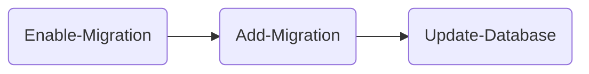

# Daily Notes - Uncategorized topic

## Simple Real Time App Architecture

You can create a simple real time app in less than one hour. 

Using something like this:

1. Using Firebase's FireStore to store data. The data will be automatically updated after any change on database
2. Using Firebase's Cloud Function to call api in somewhere. Don't care about server, host...
3. Using NodeJs, Angular, React, whatever you prefer to create simple client app


> *Instead using Google Firebase, you can use Microsoft Azure (Notification Hub, CosmosDB, Azure Function)*

*Reference*

[Real Time scraping using Puppeteer](https://medium.com/stink-studios/real-time-scraping-using-puppeteer-40495b5fc270)


## Best practices for a clean and performance Angular application

https://www.freecodecamp.org/news/best-practices-for-a-clean-and-performant-angular-application-288e7b39eb6f/

### Clean up subscriptions

When subscribing to observables, always make sure you unsubscribe from them appropriately by using operators like take, takeUntil, etc.

**Why?**

Failing to unsubscribe from observables will lead to unwanted memory leaks as the observable stream is left open, potentially even after a component has been destroyed / the user has navigated to another page.

Even better, make a lint rule for detecting observables that are not unsubscribed.

**Before**

```typescript
iAmAnObservable
    .pipe(
       map(value => value.item)     
     )
    .subscribe(item => this.textToDisplay = item);
```

**After**

Using `takeUntil` when you want to listen to the changes until another observable emits a value:

```typescript
private _destroyed$ = new Subject();

public ngOnInit (): void {
    iAmAnObservable
    .pipe(
       map(value => value.item),
       take(1),
       // We want to listen to iAmAnObservable until the component is destroyed,
       takeUntil(this._destroyed$)
     )
    .subscribe(item => this.textToDisplay = item);
}

public ngOnDestroy (): void {
    this._destroyed$.next();
    this._destroyed$.complete();
}

```

Using a private subject like this is a pattern to manage unsubscribing many observables in the component.

> Note the usage of `takeUntil` with take here. This is to avoid memory leaks caused when the subscription hasn’t received a value before the component got destroyed. Without `takeUntil` here, the subscription would still hang around until it gets the first value, but since the component has already gotten destroyed, it will never get a value — leading to a memory leak.


## How difference between `Rather than` and `Other than`?
Rather than is like saying instead of

    The food was cooked with flame rather than electric heat

Other than is like saying except or except for

    He said he doesn't own any property other than his home

I'm sorry I'm not better with technical definitions...😬


## Web Performance Tool

### Basic Terms

TTFB - Time To First Byte
First Paint (Start Render)
Contentful Paint (First Meaningful Paint)
Dom Init
Dom Loaded
Speed Index
Page Load
Fully Loaded


### Some tips to improve

## Entity Framework (EF) Migration

### Auto migration

Just using the code 

`Database.SetInitializer(new MigrateDatabaseToLatestVersion<MyDBContext, MyDBConfiguration>());`

```csharp
    public class MyDBContext : DbContext
    {
        public MyDBContext() : base("Connection String Name")
        {
            Database.SetInitializer(new CreateDatabaseIfNotExists<MyDBContext>());
            Database.SetInitializer(new MigrateDatabaseToLatestVersion<MyDBContext, MyDBConfiguration>());
        }

    }

    public class MyDBConfiguration : DbMigrationsConfiguration<MyDBContext>
    {
        public MyDBConfiguration()
        {
            AutomaticMigrationsEnabled = true;
            AutomaticMigrationDataLossAllowed = true;
            MigrationsDirectory = @"Migrations\MyDBContext";
        }
    }
```

### Manually migration (Migration Command)

General flow migration command



| Command          | Description                                                                                     | Parameters                                                                                                                                                                 |
| ---------------- | ----------------------------------------------------------------------------------------------- | -------------------------------------------------------------------------------------------------------------------------------------------------------------------------- |
| Enable-Migration | Without param -> generate `Migrates` folder and `Configuration.cs`                              | `-ProjectName NameOfProject`<br>`-MigrationsDirectory "Migrations\ContextA"` <br> `-ContextTypeName MyProject.Models.DBContextA`                                           |
| Add-Migration    | Detect the difference between Model and Database <br>to generate the script or migrate cs files | `-ProjectName NameOfProject`<br>`-Name MigrateFileName` <br>`-ConfigurationTypeName ConfigA` <br> Note: Without parameter will use `Configuration.cs` in `Migrates` folder |
| Update-Database  | Run update database based on migrate files                                                      | `-ProjectName NameOfProject`<br>`-ConfigurationTypeName ConfigurationB` <br> Rollback to a migrate file:  <br>  `-TargetMigration:MigrateFileName`                         |


**Remarks**

>To see the examples, type: get-help Enable-Migrations -examples.

>For more information, type: get-help Enable-Migrations -detailed.

>For technical information, type: get-help Enable-Migrations -full.

**Reference**

[How do I enable EF migrations for multiple contexts to separate databases?](https://stackoverflow.com/questions/13469881/how-do-i-enable-ef-migrations-for-multiple-contexts-to-separate-databases)

## Add WebAPI into the existing WebMVC project

Step 1: Adding the necessary WebAPI packages

Step 2: Configuring the routing

```csharp
public static class WebApiConfig
    {
        public static void Register(HttpConfiguration config)
        {
            config.MapHttpAttributeRoutes();
 
            config.Routes.MapHttpRoute(
                name: "DefaultApi",
                routeTemplate: "api/{controller}/{action}/{id}",
                defaults: new { id = RouteParameter.Optional }
            );
        }
    }
```
Step 3: Register api routing
In the `Application_Start` method of the file `Global.asax.cs` file, we will add a call to  `GlobalConfiguration.Configure`; be careful to place it before  the call to `RouteConfig.RegisterRoutes`(RouteTable.Routes):

```csharp
public class MvcApplication : System.Web.HttpApplication
    {
        protected void Application_Start()
        {
            AreaRegistration.RegisterAllAreas();
            GlobalConfiguration.Configure(WebApiConfig.Register);
            RouteConfig.RegisterRoutes(RouteTable.Routes);
        }
    }
```

Example:

```csharp
namespace WebApplication1.Controllers.webapi
{
    [RoutePrefix("api/Students")]
    public class WepApiController : ApiController
    {
        [HttpGet]
        [Route("GetStudents")]
        public List GetStudents()
        {
            List studentList = new List();
 
            string[] students = { "John", "Henry", "Jane", "Martha" };
 
            foreach (string student in students)
            {
                Student currentStudent = new Student
                {
                    Name = student,
                    Email = student + "@academy.com"
                };
                studentList.Add(currentStudent);
            }
            return studentList;
        }
    }
}
```

**http://localhost/api/Students/GetStudents**

**Reference**

[Adding Web API Support to an Existing ASP.NET MVC Project](https://developerslogblog.wordpress.com/2016/12/30/adding-web-api-support-to-an-existing-asp-net-mvc-project/)


## Practices for creating Api

> Should apply for creating service

* Should have base api controller for handle exception in one place

```csharp
public abstract class BaseApiController : ApiController
    {
        private readonly ILog _logger = LogManager.GetLogger(typeof(BaseApiController));

        protected T HandleExceptions<T>(Func<T> func) where T : BaseApiResponse, new()
        {
            return HandleExceptions(func, null);
        }

        protected T HandleExceptions<T>(Func<T> func, string errorMessage) where T : BaseApiResponse, new()
        {
            try
            {
                var response = func();

                var customResponse = response.ResponseResult;
                response.ResponseResult = new TrmResponse()
                {
                    StatusCode = customResponse != null && customResponse.StatusCode != 0 ? customResponse.StatusCode : HttpStatusCode.OK,
                    ResponseMessage = customResponse?.ResponseMessage ?? "OK"
                };
                return response;
            }
            catch (Exception ex)
            {
                if (string.IsNullOrEmpty(errorMessage))
                    errorMessage = $"An error has occurred when getting {typeof(T).Name}";

                _logger.Error(errorMessage + ex.StackTrace);
                var t = new T()
                {
                    ResponseResult = new TrmResponse()
                    {
                        StatusCode = HttpStatusCode.InternalServerError,
                        ResponseMessage = errorMessage,
                        Exception = ex
                    }
                };
                return t;
            }
        }
    }

```
Example using `HandleException`

```csharp
    [HttpGet]
    [AcceptVerbs("GET")]
    [ResponseType(typeof(ExportTransactionResponse))]
    public virtual ExportTransactionResponse GetExportTransactions(
        int transactionType = -1,
        string integrationStatus = null,
        string contactId = null,
        int numberItems = 0)
        {
            return HandleExceptions(() => new ExportTransactionResponse()
            {
                ExportTransactions = _exportTransactionsHelper.GetExportTransactions(
                    transactionType,
                    integrationStatus, contactId,
                    numberItems).ToList()
            });
        }
```

* Should have base response class for consistency

## Angular - Inject all Services that implement some Interface

Using `[InjectionToken](https://angular.io/api/core/InjectionToken)`

```typescript
var myInterfaceToken new InjectionToken<MyInterface>('MyInterface');
```

```typescript

// import `myInterfaceToken` to make it available in this file

@NgModule({
  providers: [ 
    { provide: myInterfaceToken, useClass: Service1, multi:true },
    { provide: myInterfaceToken, useClass: Service2, multi:true },
  ],
  boostrap: [AppComponent],
)
class AppComponent {}
```

```typescript
// import `myInterfaceToken` to make it available in this file

export class CollectorService {
    constructor(@Inject(myInterfaceToken) services:MyInterface[]) {
        services.forEach(s => s.foo());
    }
}
```

Source:

[Inject all Services that implement some Interface](https://stackoverflow.com/questions/35916542/inject-all-services-that-implement-some-interface/35916788#35916788)


https://maginus.atlassian.net/browse/NRAL-2500