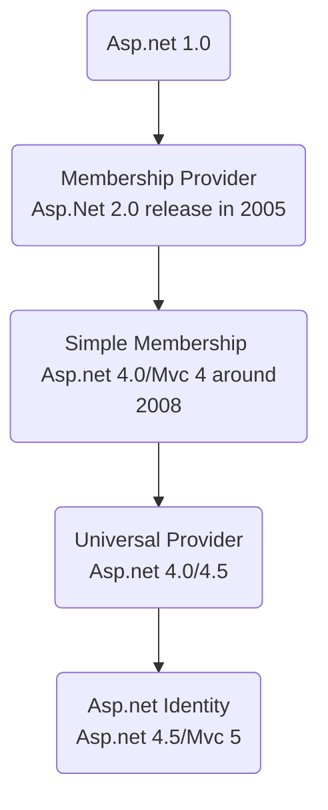
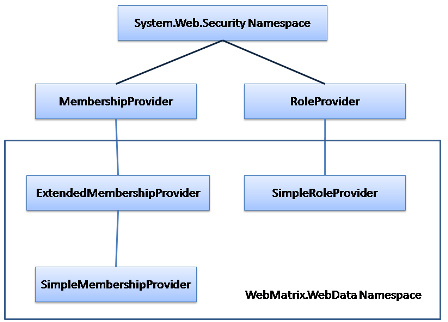
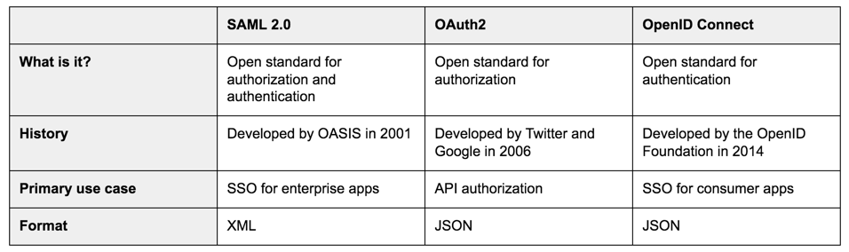
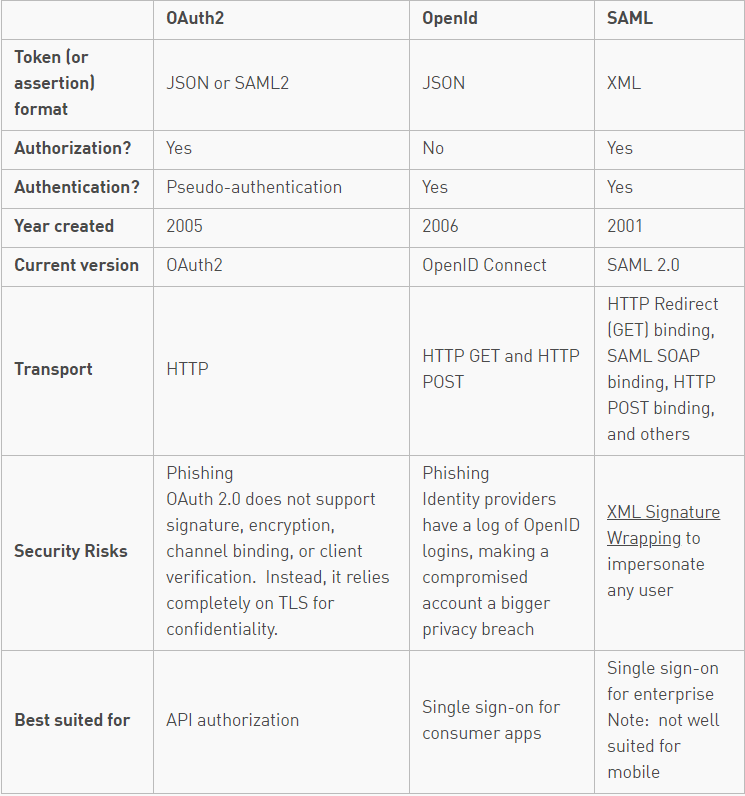

# Daily Notes - Uncategorized topic

## Simple Real Time App Architecture

You can create a simple real time app in less than one hour. 

Using something like this:

1. Using Firebase's FireStore to store data. The data will be automatically updated after any change on database
2. Using Firebase's Cloud Function to call api in somewhere. Don't care about server, host...
3. Using NodeJs, Angular, React, whatever you prefer to create simple client app


> *Instead using Google Firebase, you can use Microsoft Azure (Notification Hub, CosmosDB, Azure Function)*

*Reference*

[Real Time scraping using Puppeteer](https://medium.com/stink-studios/real-time-scraping-using-puppeteer-40495b5fc270)


## Best practices for a clean and performance Angular application

https://www.freecodecamp.org/news/best-practices-for-a-clean-and-performant-angular-application-288e7b39eb6f/

### Clean up subscriptions

When subscribing to observables, always make sure you unsubscribe from them appropriately by using operators like take, takeUntil, etc.

**Why?**

Failing to unsubscribe from observables will lead to unwanted memory leaks as the observable stream is left open, potentially even after a component has been destroyed / the user has navigated to another page.

Even better, make a lint rule for detecting observables that are not unsubscribed.

**Before**

```typescript
iAmAnObservable
    .pipe(
       map(value => value.item)     
     )
    .subscribe(item => this.textToDisplay = item);
```

**After**

Using `takeUntil` when you want to listen to the changes until another observable emits a value:

```typescript
private _destroyed$ = new Subject();

public ngOnInit (): void {
    iAmAnObservable
    .pipe(
       map(value => value.item),
       take(1),
       // We want to listen to iAmAnObservable until the component is destroyed,
       takeUntil(this._destroyed$)
     )
    .subscribe(item => this.textToDisplay = item);
}

public ngOnDestroy (): void {
    this._destroyed$.next();
    this._destroyed$.complete();
}

```

Using a private subject like this is a pattern to manage unsubscribing many observables in the component.

> Note the usage of `takeUntil` with take here. This is to avoid memory leaks caused when the subscription hasn’t received a value before the component got destroyed. Without `takeUntil` here, the subscription would still hang around until it gets the first value, but since the component has already gotten destroyed, it will never get a value — leading to a memory leak.


## How difference between `Rather than` and `Other than`?
Rather than is like saying instead of

    The food was cooked with flame rather than electric heat

Other than is like saying except or except for

    He said he doesn't own any property other than his home

I'm sorry I'm not better with technical definitions...😬


## Web Performance Tool

### Basic Terms

TTFB - Time To First Byte
First Paint (Start Render)
Contentful Paint (First Meaningful Paint)
Dom Init
Dom Loaded
Speed Index
Page Load
Fully Loaded


### Some tips to improve

## Entity Framework (EF) Migration

### Auto migration

Just using the code 

`Database.SetInitializer(new MigrateDatabaseToLatestVersion<MyDBContext, MyDBConfiguration>());`

```csharp
    public class MyDBContext : DbContext
    {
        public MyDBContext() : base("Connection String Name")
        {
            Database.SetInitializer(new CreateDatabaseIfNotExists<MyDBContext>());
            Database.SetInitializer(new MigrateDatabaseToLatestVersion<MyDBContext, MyDBConfiguration>());
        }

    }

    public class MyDBConfiguration : DbMigrationsConfiguration<MyDBContext>
    {
        public MyDBConfiguration()
        {
            AutomaticMigrationsEnabled = true;
            AutomaticMigrationDataLossAllowed = true;
            MigrationsDirectory = @"Migrations\MyDBContext";
        }
    }
```

### Manually migration (Migration Command)

General flow migration command


| Command          | Description                                                                                     | Parameters                                                                                                                                                                 |
| ---------------- | ----------------------------------------------------------------------------------------------- | -------------------------------------------------------------------------------------------------------------------------------------------------------------------------- |
| Enable-Migration | Without param -> generate `Migrates` folder and `Configuration.cs`                              | `-ProjectName NameOfProject`<br>`-MigrationsDirectory "Migrations\ContextA"` <br> `-ContextTypeName MyProject.Models.DBContextA`                                           |
| Add-Migration    | Detect the difference between Model and Database <br>to generate the script or migrate cs files | `-ProjectName NameOfProject`<br>`-Name MigrateFileName` <br>`-ConfigurationTypeName ConfigA` <br> Note: Without parameter will use `Configuration.cs` in `Migrates` folder |
| Update-Database  | Run update database based on migrate files                                                      | `-ProjectName NameOfProject`<br>`-ConfigurationTypeName ConfigurationB` <br> Rollback to a migrate file:  <br>  `-TargetMigration:MigrateFileName`                         |


**Remarks**

>To see the examples, type: get-help Enable-Migrations -examples.

>For more information, type: get-help Enable-Migrations -detailed.

>For technical information, type: get-help Enable-Migrations -full.

**Reference**

[How do I enable EF migrations for multiple contexts to separate databases?](https://stackoverflow.com/questions/13469881/how-do-i-enable-ef-migrations-for-multiple-contexts-to-separate-databases)

## Add WebAPI into the existing WebMVC project

Step 1: Adding the necessary WebAPI packages

Step 2: Configuring the routing

```csharp
public static class WebApiConfig
    {
        public static void Register(HttpConfiguration config)
        {
            config.MapHttpAttributeRoutes();
 
            config.Routes.MapHttpRoute(
                name: "DefaultApi",
                routeTemplate: "api/{controller}/{action}/{id}",
                defaults: new { id = RouteParameter.Optional }
            );
        }
    }
```
Step 3: Register api routing
In the `Application_Start` method of the file `Global.asax.cs` file, we will add a call to  `GlobalConfiguration.Configure`; be careful to place it before  the call to `RouteConfig.RegisterRoutes`(RouteTable.Routes):

```csharp
public class MvcApplication : System.Web.HttpApplication
    {
        protected void Application_Start()
        {
            AreaRegistration.RegisterAllAreas();
            GlobalConfiguration.Configure(WebApiConfig.Register);
            RouteConfig.RegisterRoutes(RouteTable.Routes);
        }
    }
```

Example:

```csharp
namespace WebApplication1.Controllers.webapi
{
    [RoutePrefix("api/Students")]
    public class WepApiController : ApiController
    {
        [HttpGet]
        [Route("GetStudents")]
        public List GetStudents()
        {
            List studentList = new List();
 
            string[] students = { "John", "Henry", "Jane", "Martha" };
 
            foreach (string student in students)
            {
                Student currentStudent = new Student
                {
                    Name = student,
                    Email = student + "@academy.com"
                };
                studentList.Add(currentStudent);
            }
            return studentList;
        }
    }
}
```

**http://localhost/api/Students/GetStudents**

**Reference**

[Adding Web API Support to an Existing ASP.NET MVC Project](https://developerslogblog.wordpress.com/2016/12/30/adding-web-api-support-to-an-existing-asp-net-mvc-project/)


## Practices for creating Api

> Should apply for creating service

* Should have base api controller for handle exception in one place

```csharp
public abstract class BaseApiController : ApiController
    {
        private readonly ILog _logger = LogManager.GetLogger(typeof(BaseApiController));

        protected T HandleExceptions<T>(Func<T> func) where T : BaseApiResponse, new()
        {
            return HandleExceptions(func, null);
        }

        protected T HandleExceptions<T>(Func<T> func, string errorMessage) where T : BaseApiResponse, new()
        {
            try
            {
                var response = func();

                var customResponse = response.ResponseResult;
                response.ResponseResult = new TrmResponse()
                {
                    StatusCode = customResponse != null && customResponse.StatusCode != 0 ? customResponse.StatusCode : HttpStatusCode.OK,
                    ResponseMessage = customResponse?.ResponseMessage ?? "OK"
                };
                return response;
            }
            catch (Exception ex)
            {
                if (string.IsNullOrEmpty(errorMessage))
                    errorMessage = $"An error has occurred when getting {typeof(T).Name}";

                _logger.Error(errorMessage + ex.StackTrace);
                var t = new T()
                {
                    ResponseResult = new TrmResponse()
                    {
                        StatusCode = HttpStatusCode.InternalServerError,
                        ResponseMessage = errorMessage,
                        Exception = ex
                    }
                };
                return t;
            }
        }
    }

```
Example using `HandleException`

```csharp
    [HttpGet]
    [AcceptVerbs("GET")]
    [ResponseType(typeof(ExportTransactionResponse))]
    public virtual ExportTransactionResponse GetExportTransactions(
        int transactionType = -1,
        string integrationStatus = null,
        string contactId = null,
        int numberItems = 0)
        {
            return HandleExceptions(() => new ExportTransactionResponse()
            {
                ExportTransactions = _exportTransactionsHelper.GetExportTransactions(
                    transactionType,
                    integrationStatus, contactId,
                    numberItems).ToList()
            });
        }
```
> Should have base response class for consistency

## .Net Web API - How security to call api


Reference:

[Securing ASP.NET Web API](https://code.tutsplus.com/tutorials/securing-aspnet-web-api--cms-26012)

## Angular - Inject all Services that implement some Interface

Using `[InjectionToken](https://angular.io/api/core/InjectionToken)`

```typescript
var myInterfaceToken new InjectionToken<MyInterface>('MyInterface');
```

```typescript

// import `myInterfaceToken` to make it available in this file

@NgModule({
  providers: [ 
    { provide: myInterfaceToken, useClass: Service1, multi:true },
    { provide: myInterfaceToken, useClass: Service2, multi:true },
  ],
  boostrap: [AppComponent],
)
class AppComponent {}
```

```typescript
// import `myInterfaceToken` to make it available in this file

export class CollectorService {
    constructor(@Inject(myInterfaceToken) services:MyInterface[]) {
        services.forEach(s => s.foo());
    }
}
```

Source:

[Inject all Services that implement some Interface](https://stackoverflow.com/questions/35916542/inject-all-services-that-implement-some-interface/35916788#35916788)

## Issues Highlighted during third party penetration tests

Some security issues are raised by the Maginus customer:

https://maginus.atlassian.net/browse/NRAL-2500


## Authentication and authorization in Asp.Net

The evolution of provider



Asp.net Identity step by step:

Source: https://www.tektutorialshub.com/asp-net/asp-net-introduction-to-asp-net-identity/

https://bitoftech.net/2015/01/21/asp-net-identity-2-with-asp-net-web-api-2-accounts-management/

Why?

Membership Provider:
* Must use the MS SQL Database
* Can not custom the User table

Simple Membership Provider: tries to address these issues by offering a flexible model for authenticating the users.

The inheritance hierarchy of SimpleMembership



Reference:

[Using SimpleMembership in ASP.NET MVC 4](https://www.codeguru.com/csharp/.net/net_asp/mvc/using-simplemembership-in-asp.net-mvc-4.htm)


**What is OAuth?**

OAuth is about authorization and not authentication. Authorization is asking for permission to do stuff. 
Authentication is about proving you are the correct person because you know things. 

OAuth doesn’t pass authentication data between consumers and service providers – but instead acts as an authorization token of sorts.


**OAuth implementation**

**OAuth 1 vs OAuth 2**

OAuth 2.0 is a complete redesign from OAuth 1.0, and the two are not compatible

OAuth 2.0 is faster and easier to implement. OAuth 1.0 used complicated cryptographic requirements, only supported three flows, and did not scale.

OAuth 2.0, on the other hand, has six flows for different types of applications and requirements, and enables signed secrets over HTTPS. OAuth tokens no longer need to be encrypted on the endpoints in 2.0 since they are encrypted in transit.

https://www.varonis.com/blog/what-is-oauth/

**OAuth vs. OpenID**

OpenID is about authentication (ie. proving who you are), 

OAuth is about authorisation (ie. to grant access to functionality/data/etc.. without having to deal with the original authentication).

> OAuth is not an OpenID extension. Why OAuth is not an OpenID extension?

The answer is simple, OAuth attempts to provide a standard way for developers to offer their services via an API without forcing their users to expose their passwords (and other credentials)

If OAuth depended on OpenID, only OpenID services would be able to use it, and while OpenID is great, there are many applications where it is not suitable or desired.

> However you can OAuth and OpenID together

http://cakebaker.42dh.com/2008/04/01/openid-versus-oauth-from-the-users-perspective/

http://techastute.blogspot.com/2012/05/openid-authentication-oauth.html

[What's the difference between OpenID and OAuth?](https://stackoverflow.com/questions/1087031/whats-the-difference-between-openid-and-oauth)

**SAML vs. OAuth**

SAML (Security Assertion Markup Language) is an alternative federated authentication standard that many enterprises use for Single-Sign On (SSO). 
SAML enables enterprises to monitor who has access to corporate resources.

OAuth doesn’t share password data but instead uses authorization tokens to prove an identity between consumers and service providers. 
OAuth is an authorization protocol that allows you to approve one application interacting with another on your behalf without giving away your password.

| SAML                                                                                                                                                                                                             | OAuth                                                                                                                                                                                         |
| ---------------------------------------------------------------------------------------------------------------------------------------------------------------------------------------------------------------- | --------------------------------------------------------------------------------------------------------------------------------------------------------------------------------------------- |
| SAML uses XML to pass messages                                                                                                                                                                                   | OAuth uses JSON                                                                                                                                                                               |
| SAML is geared towards enterprise security                                                                                                                                                                       | OAuth provides a simpler mobile experience                                                                                                                                                    |
| SAML, on the other hand, drops a session cookie in a browser that allows a user to access certain web pages – great for short-lived work days, but not so great when have to log into your thermostat every day. | OAuth uses API calls extensively, which is why mobile applications, modern web applications, game consoles, and Internet of Things (IoT) devices find OAuth a better experience for the user. |

Reference

[What is OAuth? Definition and How it Works](https://www.varonis.com/blog/what-is-oauth/)

**SAML vs. OpenID**

They are two different protocols of authentication and they differ at the technical level.

SAML2 supports single sign-out - but OpenID does not

SAML 2 is based on XML while OpenID is not.

SAML2 has different bindings while the only binding OpenID has is HTTP

Same in primary use case but has difference scope

SAML - SSO for enterprise apps

OpenID - SSO for consumer apps



https://www.resilient-networks.com/concept-week-saml-oauth2-openid-connect/



https://spin.atomicobject.com/2016/05/30/openid-oauth-saml/

https://stackoverflow.com/questions/7699200/what-is-the-difference-between-openid-and-saml

**OAuth vs JWT**

OAuth 2.0 defines a protocol, i.e. specifies how tokens are transferred, JWT defines a token format.

> Firstly, we have to differentiate JWT and OAuth. Basically, JWT is a token format. OAuth is an authorization protocol that can use JWT as a token.

OAuth uses server-side and client-side storage. If you want to do real logout you must go with OAuth2. Authentication with JWT token can not logout actually. Because you don't have an Authentication Server that keeps track of tokens.

If you want to provide an API to 3rd party clients, you must use OAuth2 also.

OAuth2 is very flexible. JWT implementation is very easy and does not take long to implement.

If your application needs this sort of flexibility, you should go with OAuth2. But if you don't need this use-case scenario, implementing OAuth2 is a waste of time.


https://stackoverflow.com/questions/39909419/what-are-the-main-differences-between-jwt-and-oauth-authentication

**Can OAuth can use to authentication?**

https://oauth.net/articles/authentication/

A standard for user authentication using OAuth: OpenID Connect