# EpiServer CMS and Commerce Notes

- [EpiServer CMS and Commerce Notes](#episerver-cms-and-commerce-notes)
  - [How to override, decorate the default implement of the class in EpiServer](#how-to-override-decorate-the-default-implement-of-the-class-in-episerver)
    - [**The default implement have the method which can be override (has `virtual` keyword)**](#the-default-implement-have-the-method-which-can-be-override-has-virtual-keyword)
    - [**The default implement class don't have the method which can be override (no `virtual` keyword)**](#the-default-implement-class-dont-have-the-method-which-can-be-override-no-virtual-keyword)
    - [**Update**: Unexpected case](#update-unexpected-case)
  - [Create nice Admin tool](#create-nice-admin-tool)
    - [How to create Admin Tool which do the long progress task](#how-to-create-admin-tool-which-do-the-long-progress-task)
  - [Performance issue with find Simple URL in CMS](#performance-issue-with-find-simple-url-in-cms)
  - [Performance issue with Async keyword when call api](#performance-issue-with-async-keyword-when-call-api)
  - [There are three ways to identify an catalog entries (products, variations, bundles, packages...)](#there-are-three-ways-to-identify-an-catalog-entries-products-variations-bundles-packages)
  - [How to create Commerce Site with Epi Commerce](#how-to-create-commerce-site-with-epi-commerce)
    - [Set/get prices flow](#setget-prices-flow)
      - [Abstraction Price Model in Epi](#abstraction-price-model-in-epi)
    - [Relationship between Guest, User and Market, Currency. The flow from Guest/User to Market/Currency](#relationship-between-guest-user-and-market-currency-the-flow-from-guestuser-to-marketcurrency)
  - [Some requirements in some real projects](#some-requirements-in-some-real-projects)
  - [Notes from Quan Mai's book](#notes-from-quan-mais-book)
  - [Flow working with Find in real application](#flow-working-with-find-in-real-application)
  - [What happen when user add to cart, change quantity, remove item in code](#what-happen-when-user-add-to-cart-change-quantity-remove-item-in-code)
  - [What code flow in checkout](#what-code-flow-in-checkout)
  - [Custom Workflow in commerce](#custom-workflow-in-commerce)
  - [How promotion engine work](#how-promotion-engine-work)
  - [How modeling product in real site and how to thinking in Episerver](#how-modeling-product-in-real-site-and-how-to-thinking-in-episerver)
    - [Catalog Node Relation](#catalog-node-relation)
    - [Catalog Entry Relation](#catalog-entry-relation)
    - [Catalog Entry Association](#catalog-entry-association)
    - [Catalog Entry Structure](#catalog-entry-structure)
  - [Metadata system](#metadata-system)
  - [How integrate epi commerce with other systems](#how-integrate-epi-commerce-with-other-systems)
  - [Payment providers](#payment-providers)
  - [Custom Shipping Methods](#custom-shipping-methods)
  - [Key points](#key-points)
  - [BusinessManager](#businessmanager)
  - [Dependency Injection](#dependency-injection)
  - [DDS Behind the scenes](#dds-behind-the-scenes)

## How to override, decorate the default implement of the class in EpiServer

> Conditions: The class must to register as service via IOC using StructureMap or any IOC framework which support Decorate pattern

Based on my experience when working on some Epi commerce projects, depend on if the default implement class has the method which can be override, there are two ways to archive it

### **The default implement have the method which can be override (has `virtual` keyword)**

In EpiServer Commerce has an interface to service for updating and retrieving `EPiServer.Commerce.Order.ILineItem.PlacedPrice` for `EPiServer.Commerce.Order.IOrderGroup`.

    public interface IPlacedPriceProcessor

The default implement class

    public class DefaultPlacedPriceProcessor : IPlacedPriceProcessor

In this class, all methods are decorated with `virtual` keyword like that 

    public virtual Money? GetPlacedPrice(EntryContentBase entry, decimal quantity, CustomerContact customerContact, IMarket market, Currency currency);

So in this way, in IOC configuration using StructureMap, you can override and decorate this class with this configuration:

```csharp
    public void ConfigureContainer(ServiceConfigurationContext context)
        {
            context.StructureMap().Configure(ce =>
            {
                ce.For<IPlacedPriceProcessor>().Use<DefaultPlacedPriceProcessor>();
                ce.For<IPlacedPriceProcessor>().DecorateAllWith<TrmPlacedPriceProcessor>();
            });
        }
```

The new implement class need to inherit from the default implement `DefaultPlacedPriceProcessor`. Following this way, we can override any method and keep other methods as default.

```
public class TrmPlacedPriceProcessor : DefaultPlacedPriceProcessor, IPlacedPriceProcessor
    {
        public override Money? GetPlacedPrice(EntryContentBase entry, decimal quantity, CustomerContact customerContact,
            MarketId marketId, Currency currency) 
            {
                //Override here
            }
    }

```

So from now on, all places are using `IPlacedPriceProcessor` to invoke the method `GetPlacedPrice` will run our override code

### **The default implement class don't have the method which can be override (no `virtual` keyword)**

In Epi Commerce, there is an interface `IPriceService` with default implement class `PriceServiceDatabase`. In this class, all methods don't have any `virtual` keyword so we can not override it.

Luckily, this class is registered via IOC, we have a chance to do it.

Registered via IOC the new implement class same above

```csharp
public void ConfigureContainer(ServiceConfigurationContext context)
        {
            context.StructureMap().Configure(ce =>
            {
                ce.For<IPriceService>().Use<PriceServiceDatabase>();
                ce.For<IPriceService>().DecorateAllWith<TrmPriceService>();
            });
        }
```

The key technical step in this way: Inject `IPriceService` itself to new implement class and StructureMap will do the remain, **injecting the instance of the default implement class to using in the new implement class**

```csharp
public class TrmPriceService : IPriceService
    {
        private readonly IPriceService _mediachasePricingService;
        public TrmPriceService(IPriceService mediachasePricingService){
            _mediachasePricingService = mediachasePricingService;
        }

        public virtual IEnumerable<IPriceValue> GetCatalogEntryPrices(CatalogKey catalogKey)
        {
            //Override here
            
            //Or decorate with a wrapper here before call the default implement
            return _mediachasePricingService.GetCatalogEntryPrices(catalogKey);
        }

        //do the same with other remaining methods
    }
```

Following this way, you can decorate the default implement of any method ex add `virtual` keyword, logging, audit..

### **Update**: Unexpected case
I've just see a weird case when trying DecoratorAllWith a service class. In my case, the default implement class was registered via IOC using EpiServer `ServiceConfigurationAttribute` like that

```csharp
    [ServiceConfiguration(typeof(IAmStoreHelper), Lifecycle = ServiceInstanceScope.Singleton)]
    public class StoreHelper : IAmStoreHelper
    {
    }
```

I need the interface `IAmStoreHelper` is decorator all with `MyStoreHelper` and the default implement don't use any `virtual` keyword, so I do it via EpiServer's `ConfigurableModule` with `[ModuleDependency(typeof(ServiceContainerInitialization))]` to make sure that my implement class will be registered after default implement

```csharp
context.StructureMap().Configure(ce =>
    {
        ce.For<IAmStoreHelper>().Use<StoreHelper>();
        ce.For<IAmStoreHelper>().DecorateAllWith<MyStoreHelper>();
    });
```

Unluckily, the `DecorateAllWith` somehow is not working as my expected. I don't know what reason even I added `ce.For<IAmStoreHelper>().ClearAll()` to clear all previous registered classes of `IAmStoreHelper`. After take some while to google, i found the solution for this case:

1. Clear all previous registered implement classes
2. Using StructureMap's `Add` method to add the old default implement with a special name
3. Using StructureMap's `Use` method to register new default implement for the interface with `.Ctor` to inject the old implement to new implement

```csharp
ce.For<IAmStoreHelper>().ClearAll();
ce.For<IAmStoreHelper>().Add<StoreHelper>().Named(nameof(StoreHelper));
ce.For<IAmStoreHelper>().Use<MyStoreHelper>().Ctor<IAmStoreHelper>()
    .Is(ctx => ctx.GetInstance<IAmStoreHelper>(nameof(StoreHelper)));
```

Now i have the same result since using `DecorateAllWith`

```csharp
public class MyStoreHelper : IAmStoreHelper
    {
        private readonly IAmStoreHelper _storeHelper;
        public TrmStoreHelper(IAmStoreHelper storeHelper){
            //The old implement will injected here
            _storeHelper = storeHelper;
        }
    }
```

**Note**: This tip will also be useful for the case in which you don't want to use `DecorateAllWith`

> The difference between StructureMap's `Add()` and `Use()`, you can find here [What is the difference](https://stackoverflow.com/questions/26544754/how-di-frameworks-resolve-dependency-for-same-interface-with-multiple-configurat/27365025#27365025)

> Thanks Ha.Bui for this useful note :)

> [More about Decorate with StructureMap](https://robertlinde.se/posts/ioc,-structuremap-and-an-async-generic-repository/)

## Create nice Admin tool

You can create EpiServer admin tool using Mvc template or `.aspx` template. In case using `.aspx` template, you should follow the standard UI

1. Using EPIServerUI control
2. Using Content Placeholder
3. Set Heading and Description
4. Using EpiServer css classes


`AdminTool.aspx`

```html
<%@ Page Language="C#" AutoEventWireup="true" CodeBehind="MetalPriceImportPlugin.aspx.cs" Inherits="TRM.Web.Plugins.MetalPriceImportPlugin" %>

<%@ Register TagPrefix="EPiServerUI" Namespace="EPiServer.UI.WebControls" Assembly="EPiServer.UI" %>

<asp:content contentplaceholderid="MainRegion" runat="server">    
    <div class="epi-formArea">

        <asp:Label ID ="lblMessage"  runat="server"/>
        <div class="epi-size20 epi-paddingVertical-small">
            <div>
                <asp:Label runat="server" AssociatedControlID="fileUpload" Text="Select an csv file and upload" />
                <asp:FileUpload ID="fileUpload" runat="server"  />
            </div>
        </div>
            
        <div class="epi-buttonContainer">
            <EPiServerUI:ToolButton id="ImportButton" OnClick="ImportButton_OnClick" runat="server" SkinID="Import" text="Begin Import"  tooltip="Begin Import"  />            
        </div>
    </div>
</asp:content>
```

`AdminTool.aspx.cs`
```csharp
[GuiPlugIn(
    DisplayName = "Import Metal Price",
    Area = PlugInArea.AdminMenu,
    Url = "~/Plugins/MetalPriceImportPlugin.aspx",
    RequiredAccess = AccessLevel.Administer)]
public partial class MetalPriceImportPlugin : WebFormsBase
{
    protected void Page_Load(object sender, EventArgs e)
    {
    }

    protected override void OnPreInit(EventArgs e)
    {
        base.OnPreInit(e);
        this.SystemMessageContainer.Heading = "This is Plugin Heading";
        this.SystemMessageContainer.Description = "This is description";
    }
}
```

### How to create Admin Tool which do the long progress task

**Using ThreadPool**

Plugin need to inherit from `System.Web.UI.ICallbackEventHandler` and implement the `GetCallbackResult()` to return data to callback call

```csharp
using System.Web.UI;
public partial class MetalPriceImportPlugin : WebFormsBase, ICallbackEventHandler
{
    //using static variable to store work's status
    private static WhateverClass _workStatus;

    //Need to inject the callback javascript function
    protected void Page_Load(object sender, EventArgs e)
    {
        var callbackScript =
                $"function PluginDoCallback(callbackArgument, completedCallback){{ \n{Page.ClientScript.GetCallbackEventReference(this, "callbackArgument", "completedCallback", null, true)};\n}}";
            Page.ClientScript.RegisterClientScriptBlock(GetType(), "PluginDoCallback", callbackScript, true);

        //If we are doing a callback we don't need to process anymore information from page. 
        if (IsCallback)
        {
            return;
        }  
    }

    protected void StartLongTaskButton_OnClick(object sender, EventArgs e)
    {
        _workStatus = new WhateverClass()

        EPiServer.Security.PrincipalInfo.RecreatePrincipalForThreading();
        ThreadPool.QueueUserWorkItem(new WaitCallback(LongTaskThread), _workStatus);

        ScriptManager.AddEventListener(this, EventType.Load, "function(){DoUpdateCallback();}");
    }

    public string GetCallbackResult()
    {
        Page.Response.ContentType = "application/json";
        var sbJson = new StringBuilder();
        sbJson.Append("{");
        //Build json body here from _workStatus field
        sbJson.AppendLine("}");
        return sbJson.ToString();
    }

}
```

in `aspx` file

```html

<asp:content contentplaceholderid="HeaderContentRegion" runat="server">
    <script type="text/javascript">
        //Function to send callback information back to server.
        //Wrapped in a function so you can send callback arguments..if you need  to.
        function DoUpdateCallback(callbackArgument) {
            PluginDoCallback(callbackArgument, _OnCallbackComplete);
        }

        //Response from server side with data from importer as a JSON object.
        //The result get from GetCallbackResult() in cs file
        function _OnCallbackComplete(result, context) {
            var parsedResult = null;
            //Eval JSON object.
            eval("parsedResult = " + result);
            //Writes progress of exporter
            if (parsedResult["IsDone"] == false) {
                //do other works when job isn't finish
                document.body.style.cursor = 'wait';
                window.setTimeout("DoUpdateCallback()", 1000);
            } else {
                document.body.style.cursor = '';
                //do other works when job done
                <%= Page.ClientScript.GetPostBackEventReference(new PostBackOptions(this))%>;
            }
        }
        
    </script>
</asp:content>

```

**How to update progress to client user when task is processing**

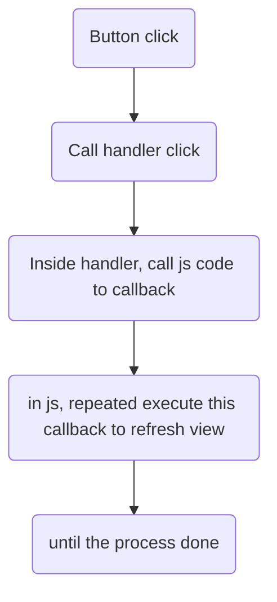

> Using static variable to store global data for thread reading/writing

**Reference** 
[How to create a nice looking admin plugin](https://world.episerver.com/blogs/Per-Nergard/Dates/2013/4/How-to-create-a-nice-looking-admin-plugin/)


## Performance issue with find Simple URL in CMS

An our customer found this issue when he investigated the performance issues on Production. Basically, his site have a lot of apis however those are quite slow in an expected way. The root cause is the router for apis were registered after "Simple URL" router of EpiServer. This is led to each api was called, the site need to resolve SimpleURL router first then api router. This is unnecessary thing.

=> So all custom routers in an Epi site should register before SimpleURL

All code for register custom routers need to make sure run firstly before the below code

```csharp
public void Initialize(InitializationEngine context)
{
    //Register custom routers here

    //Remove "simpleaddress" router and add it to last
    Global.RoutesRegistered += Global_RoutesRegistered;
}

private void Global_RoutesRegistered(object sender, RouteRegistrationEventArgs e)
{
    var simpleAddressRouter =
        e.Routes.OfType<IContentRoute>().FirstOrDefault(r => r.Name.Equal.("simpleaddress"));
    if (simpleAddressRouter != null)
    {
        e.Routes.Remove((RouteBase) simpleAddressRouter);
        e.Routes.Add(simpleAddressRouter);
    }
}
```

**Reference**

https://vimvq1987.com/episerver-cms-performance-optimization-part-1/

https://world.episerver.com/documentation/Release-Notes/ReleaseNote/?releaseNoteId=CMS-7791


## Performance issue with Async keyword when call api

i think when ha bui implemented OWIN, we have custom pipeline
and maybe too much code is running on every request - including images & api requests
with async, we have some waiting/blocking in a lot of requests - so everything is getting very slow/very bad

it seems hard to understand
beyond me i think...
in the picture - see preexecuterequesthandler, takes 400ms
that is very very bad

so api requests taking 600 ms, should be 200ms (edited) 
i think if we understand, easy fix - but needs big understanding first...
but i think if it does get fixed, we save 70% performance
which could be crazy fast

[PreExecuteRequestHandler delay on Web Api](https://discuss.newrelic.com/t/preexecuterequesthandler-delay-on-web-api/52621/10)


## There are three ways to identify an catalog entries (products, variations, bundles, packages...)

An Id (int), a code (string) or an unique identifier (Guid, introduced in Commerce 7.10).

* An `Id` is used internally within the catalog
* A `Guid` is used to communicate with Episerver CMS (if you have worked with Episerver CMS, you might know the concept of permanent link)
* A `Code` is used to work with external systems, such as ERP or PIM. Almost every feature which might work with external system works with code.

Since Epi Commerce integrated tightly with Epi Cms, each `Node` or `Entry` has `ContentLink` with type `ContentReference`

**So how to convert between cms`ContentLink` and commerce `Id`, `Code`**
> For `Guid`, we don't often use it in real application

Using **[ReferenceConverter](https://world.episerver.com/documentation/Class-library/?documentId=commerce/13/99E11299)**

1. Get cms `ContentLink` from commerce `Code`

```csharp
    var referenceConverter = ServiceLocator.Current.GetInstance<ReferenceConverter>();

    var code = "variant-code"; 
    var variantLink = referenceConverter.GetContentLink(code);
```

2. Get cms `ContentLink` from commerce `Id`

```csharp
    var referenceConverter = ServiceLocator.Current.GetInstance<ReferenceConverter>();
    var commerceId = 22;
    var workId = 0;

    var variantLink= referenceConverter.GetContentLink(commerceId , workId);
```

3. Get commerce `Id` from cms `ContentLink`

```csharp
    var contentLink = new ContentReference(4);
    var referenceConverter = ServiceLocator.Current.GetInstance<ReferenceConverter>();

    var entryId = referenceConverter.GetObjectId(contentLink);
```

4. Get commerce `Code` from cms `ContentLink`

```csharp
    var contentLoader = ServiceLocator.Current.GetInstance<IContentLoader>();

    var entry = contentLoader.Get<EntryContentBase>(entryContentLink)?.Code;
```

**References**

* [How To Load And Retrieve A Variant Or Product From Episerver Commerce](http://www.jondjones.com/learn-episerver-cms/episerver-commerce/how-to-load-and-retrieve-a-variant-or-product-from-episerver-commerce)
* [Catalog content provider](https://world.episerver.com/documentation/developer-guides/commerce/catalogs/catalog-content/Catalog-content-provider/)

## How to create Commerce Site with Epi Commerce

### Set/get prices flow

* How Epi commerce store price for each variant
  * Relationship with Market, Currency, Variant Code (SKU), Customer Group (Sale Code), Sale Type, 
  * Setup list prices
* How get prices: IPriceValue, Mediachase IPriceService, IPromotionService
* Create flow diagram from QuickSilver to illustrate

What default services Epi Commerce provide?

`IPriceService` (The readonly get price service) using `PriceFilter` -> to get original price

`IPriceDetailService` (The service for update price)

`IPromotionEngine, IPromotionEngineExtensions` to get discounted price

#### Abstraction Price Model in Epi

Epi Price Object include:
* Market
* Currency
* Sale Type (CustomerPricing)
* Sale Code
* Price Amount
* Min Quantity
* StartDate, EndDate

Using PriceFilter (Currency, Quantity, CustomerPricing = Sale Type  + Sale Code) to get prices by IPriceService

**In real application**

How to get original price (or sale price) using `IPriceService` and `PriceFilter`

For Guest

* Guest -> 
  * Default Market + Default Currency -> 
    * Default Sale Type = "All customers" (let Sale Code is empty) -> 
      * Quantity -> 
        * List prices -> 
          * Get lowest price

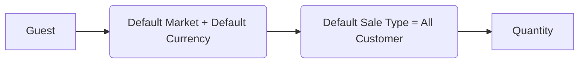

> Snippet code for each step

For Logged in User

* Logged in User => 
  * Depend on business -> Get Market form User/Organization (by Prefers Address country code) -> 
    * Get Currency (from the Market's default currency or Contact's Prefers Currency) -> 
      * Add default sale code + customer sale code (form "CustomerGroup" meta field of Contact) -> 
        * Add Quantity -> 
          * List prices -> 
            * Get lowest price

> Show snippet code for each step side by side

How to get discounted price using `IPromotionEngineExtensions`

> Best practices: Should wrap the default PriceService, and PromotionEngine with our `IPricingService` and `IPromotionService`

**Scenario** Using the "CustomerGroup" meta field or `EffectiveCustomerGroup` property of `Contact` entity
1. There are some special customers who are offered the better price than normal. In this case, those customers should belong a special group ex VIP, or Loyal Group and we will set a lower price for those group.
   > Note you must to set price is lower than price in Sale Type is All customers

2. In Royalmint project, there is a requirement when user be checkout progress, they change deliver address to the region where don't be charged the tax. Ex UK has tax of 20% in mean while US has no tax. So the price for US market will be lower than other market. This requirement should be regard to multi store

### Relationship between Guest, User and Market, Currency. The flow from Guest/User to Market/Currency

What default services Epi Commerce provide?

For Market: `ICurrentMarket` and `IMarketService`

How to get/set Market and Currency for

Guest -> go to commerce site -> see price and discounted price

* Guest -> 
  * Get Default Market (The default market in epi has name "DEFAULT" was set in `MarketId` class. Must setting the default market in Commerce Manager) -> 
    * Get Default Currency from this Market (Each market must have unique default currency which was set in Commerce Manager)

Guest -> register -> User -> see price and discounted price

* Guest ->
  * Register -> Set Prefers Shipping Address + Prefers Billing Address
    * Create contact
      * Login
        * Update Market...

> Depend on business, user can set prefers currency or get default one from market

> In real application, there is often case in which the default market based on guest's location or user's address. The market and currency will be store in Cookie or one customer' metal field

> Best practices: Should have our `CurrentMarket` and `CurrentCurrency` be implemented by yourself

## Some requirements in some real projects

1. Bullion - Multi shipments: 
2. Bullion - Multi carts
3. Ralawise - Catalog Model - Custom to show basket (Product Group -> Product Color -> Variant) -> Add variant -> show product group on basket
4. Royalmint -> Price not Vat depend on deliver address
5. Ralawise - Custom price system -> Custom DB ->  a lot price with a lot of Sale Codes for each variant
6. Royalmint -> Integrate the third party tool to personalization for each product -> custom price
7. EpiFind -> how index price for the system which have the custom price (Get price from other source instead Epi Commerce)
8. Email back to stock
9. Migration: Import data from an old system
10. Bullion: Should not using DDS in Schedule job especial when you have plan deploy to DXC
11. Bullion: using IQueryable (for reuseable query later) and IEnumerable in EF
12. How force epi cms using Our custom Media File instead the default image 

## Notes from Quan Mai's book

We’ll see how markets are used. The market concept affects almost every aspect of Episerver Commerce.

* As from previous chapter, we’ve learned that an entry might or might not be available in a market. This is defined by a special metafield named _ExcludedCatalogEntryMarkets. This
contains list of MarketId which the entry is not available in _ExcludedCatalogEntryMarkets
metafield.

* Markets also control the prices: a price must belong to a market. Warehouses and inventories, however, are not tied to any markets (which is reasonable because a warehouse might serve more than 1 markets)

* Orders must belong to specific markets. Shipping methods and payment gateways also need
to be available in a specific market, however, they are still grouped by languages. This was because of backward compatibility reasons, and in the future versions shipping methods and payment gateways might be changed to be grouped by markets.

**You should only define new market since you know actually this market need for what.**

>  When define new market in Commerce, you should aware it may be impact the price and causes some unexpected behaviors. Actually, your code flow when working with Market and Currency is the root cause rather than the Epi market itself don't causes those behaviors. 
> 
> For example, in my project of company, our customer defined two way get currency, one get from Contact's prefers currency, other one get from Market's default currency. 

> Our CM has only one default market: UK with default currency GBP.
> 
> Then user --> registered has address in US with prefers currency is USA ->in our code we let user in Default Market (UK), so this user will be see the price in GBP (fine with end client and as customer's expected)
>
> Later, someone define new US market, may be for testing purpose and forget delete it.
> 
> Other user also registered in US (USA) -> in our code we let user in US market ---> user will be see price in USA but we don't setup price in this market -> actual result user see price is 0 in GBP -> unexpected result


## Flow working with Find in real application

when index, scan all content, some fields/content are unnecessary (may be so ), should ignore in Find -> How to ignore -> init module or attribute (json ignore)

Facet -> 2 types -> terms and range, is created from the result

autocomplete -> remember keyword

apply bet bet

Fi
bullion: 


## What happen when user add to cart, change quantity, remove item in code

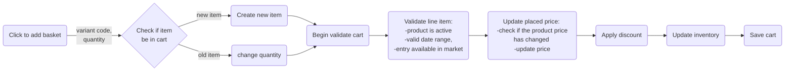

What action should you need validate cart?

Whatever action impart shopping cart:

* Add/Change/Remove line item
* Apply/Remove promotion
* Add/Remove shipments
* Merge cart


```csharp
    public Dictionary<ILineItem, List<ValidationIssue>> ValidateCart(ICart cart)
    {
        if (cart.Name.Equals(DefaultWishListName))
        {
            return new Dictionary<ILineItem, List<ValidationIssue>>();
        }

        var validationIssues = new Dictionary<ILineItem, List<ValidationIssue>>();
        cart.ValidateOrRemoveLineItems((item, issue) => validationIssues.AddValidationIssues(item, issue),
        _lineItemValidator);
                
        cart.UpdatePlacedPriceOrRemoveLineItems(CustomerContext.Current.GetContactById (cart.CustomerId),
        (item, issue) => validationIssues.AddValidationIssues(item, issue), 
        _placedPriceProcessor);

        cart.UpdateInventoryOrRemoveLineItems((item, issue) => validationIssues.AddValidationIssues(item, issue), 
        _inventoryProcessor);

        cart.ApplyDiscounts(_promotionEngine, new PromotionEngineSettings());

        // Try to validate gift items inventory and don't catch validation issues.
        cart.UpdateInventoryOrRemoveLineItems((item, issue) => {},
        _inventoryProcessor);

        return validationIssues;
    }

```

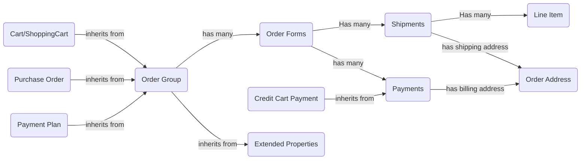

## What code flow in checkout


Place Order process

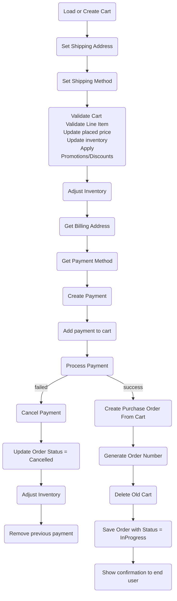

## Custom Workflow in commerce

## How promotion engine work

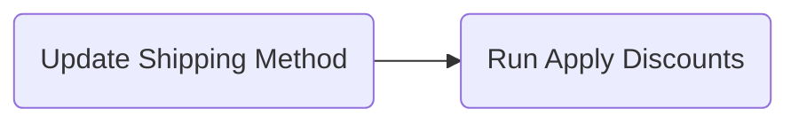

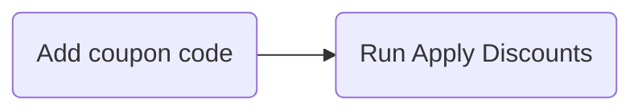

## How modeling product in real site and how to thinking in Episerver

**Step 1: How modeling Ralawise site in OOP design**

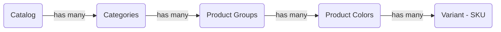

**Step 2: Mapping OOP design with catalog system of epi commerce**

Episerver catalog system:

Catalog components

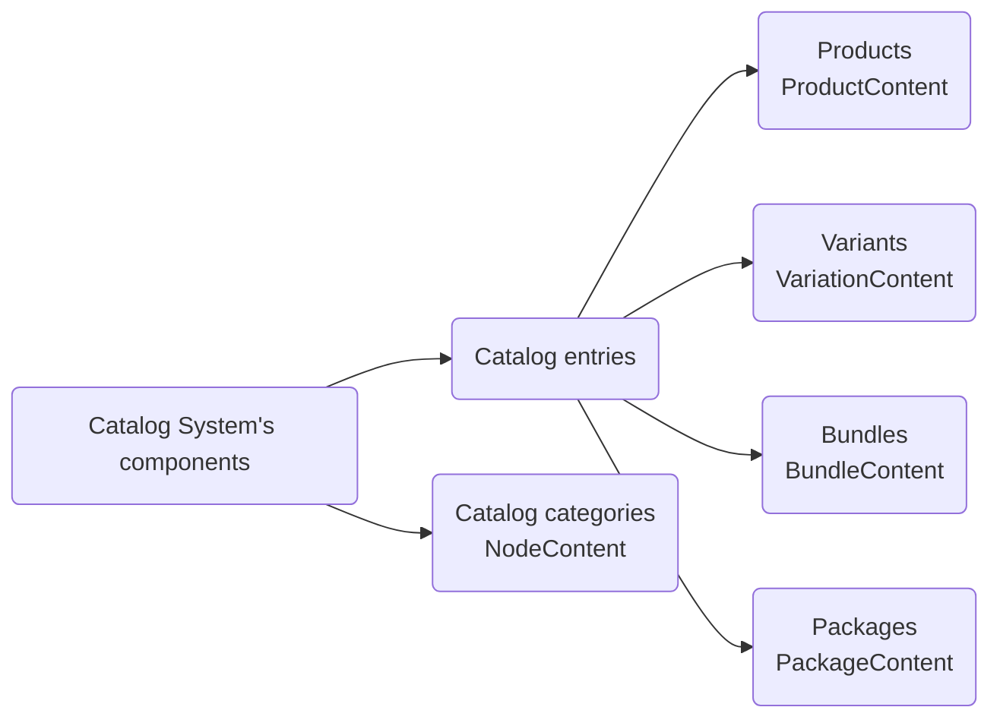

> If the catalog system is the heart of entire Episerver Commerce, the entries can be called the heart of the catalog system. In the end it’s the only thing your customers care about, right? And it might no be simple as you might think.

Catalog Content Type name in Catalog UI and relation

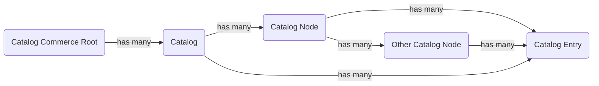

Mapping with Type name

| Catalog Type  | Type Name                                                                   |
| ------------- | --------------------------------------------------------------------------- |
| Catalog Root  | RootContent                                                                 |
| Catalog       | CatalogContent                                                              |
| Catalog Node  | NodeContent                                                                 |
| Catalog Entry | ProductContent <br> VariationContent <br> BundleContent <br> PackageContent |

The following types are available when you create Commerce models.

| Type name        | Description                      |
| ---------------- | -------------------------------- |
| VariationContent | A type for variant/SKU models    |
| ProductContent   | A type for product models.       |
| BundleContent    | A type for bundle models.        |
| PackageContent   | A type for package models.       |
| NodeContent      | A type for category/node models. |

You should not inherit from the following types because they exist only to show various states in the system:

| Type name        | Description                                                                                                |
| ---------------- | ---------------------------------------------------------------------------------------------------------- |
| CatalogContent   | A type for catalog models.                                                                                 |
| EntryContentBase | A base type for VariationContent, ProductContent, BundleContent, PackageContent and DynamicPackageContent. |
| NodeContentBase  | A base type for NodeContent and CatalogContent.                                                            |
| RootContent      | The virtual root in Episerver's hierarchical representation of Commerce content.                           |

Catalog system's classes design

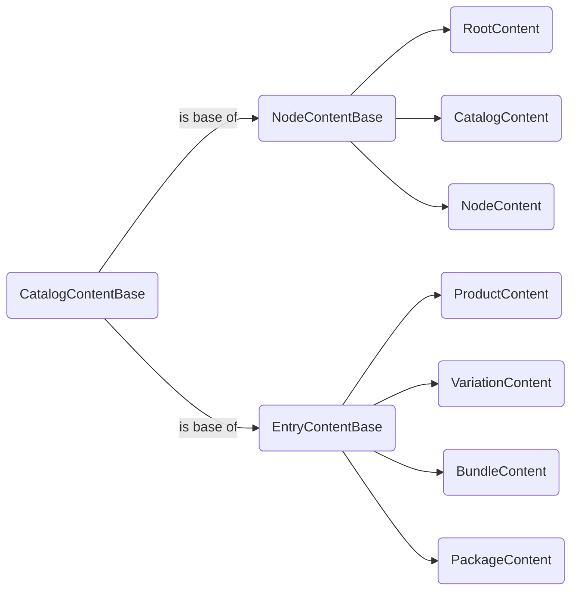

**Product:** 

Well it’s a product. Normally, a Product is a place holder of information, it does not
have inventories or prices for itself, so it’s not sell-able. (I’ve seen some customers sell products
directly, it’s possible but it will be a lot more of works. I would suggest you to stick with the
“standard” implementation instead). A product might have one or more variations.

> There are Commerce sites which use Products as Variations, such as they have Prices on their own. Or some sites allow a Product to be the parent of other products. Those are possible, however, it’ll make the implementation harder. I would suggest to stick with the common way.

**Variation/SKU:**

A variation might have its own inventories and prices. In the end, it’s the thing your customers
actually buy. However, it’s possible your variations have no products on their own (when each and
every variation is unique and don’t share anything with other variation, it does not really make
sense to have “products” here).

**Package:**

A package consists of two or more variations, which itself act as a variation. Think of
a package as a collection of items. You might have Harry Potter books as seven variations, and
then you have a collection of them as a package. Package has its own prices and inventories.
Therefore, when you buy, you all of items as one. Customers should not have the ability to
change the quantity or remove items from a package.

**Bundle:**

A bundle is just a collection of things you can add to the cart at once, but then they
acts as individual items. They are something customers buy together, but are not forced to do
so. You can change quantity of or remove items from the cart if you’d like to. Bundles have
no prices or inventories of its own.

### Catalog Node Relation

* `NodeRelation` between Catalog Node and its nodes or entries

[Categorizations](https://world.episerver.com/documentation/developer-guides/commerce/catalogs/catalog-content/Categorizations/)

### Catalog Entry Relation

There are three class representation the relations between entries

* `ProductVariation` between a product and its variations
* `BundleEntry` between a bundle and its entries.
* `PackageEntry` between a package and its entries.

Each class has two key fields:

* Parent(ContentReference) reference To Product/Package/Bundle
* Child(ContentReference) reference To Variation

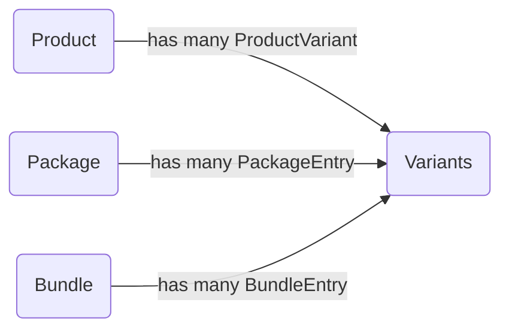

using `EPiServer.Commerce.Catalog.Linking.IRelationRepository` to add, remove, get children, get parents

ADD: `IRelationRepository.UpdateRelation(ProductVariation/BundleEntry/PackageEntry)`

REMOVE: RemoveRelation

GET CHILDREN: GetChildren

GET PARENTS: GetParents

> Used to import manually product instead of using Episerver's Service API

More details:

[Product variants](https://world.episerver.com/documentation/developer-guides/commerce/catalogs/catalog-content/Product-variants/)
[Bundles and packages](https://world.episerver.com/documentation/developer-guides/commerce/catalogs/catalog-content/Bundles-and-packages/)

### Catalog Entry Association

for what?

> Associations are the connections between products, so you can cross sell, or up sell other products. For example, if you are selling a table, you would want your customers to buy a chair.

using `EPiServer.Commerce.Catalog.Linking.IAssociationRepository`

Define `Group` for each association such as  "CrossSell", "UpSell"... to get related entries when user view detail product or add to cart...

> For example, you can have a association group named CrossSell to define the products which can be suggested to customers when they have a product in cart.

[Related entries](https://world.episerver.com/documentation/developer-guides/commerce/catalogs/catalog-content/Related-entries/)

### Catalog Entry Structure

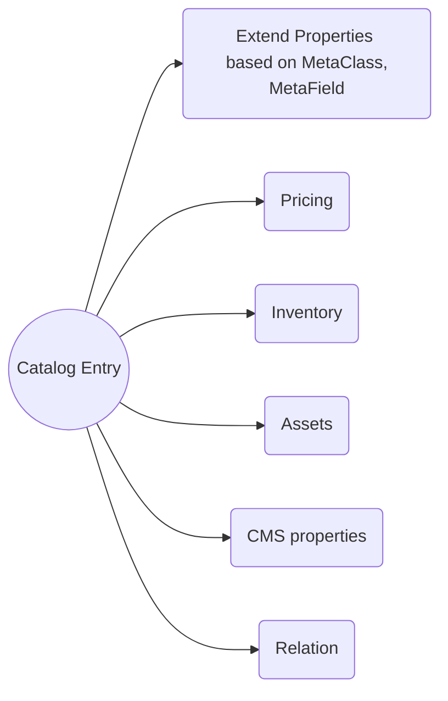

## Metadata system

To design dynamic entity to adapt with all kind of business

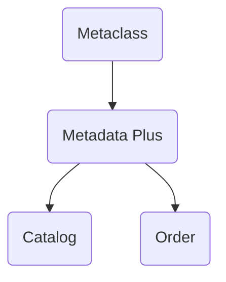

## How integrate epi commerce with other systems

## Payment providers

Note: Need to import the xml which contains the payment meta class in commerce manager

## Custom Shipping Methods

## Key points


Limitations in synchronization –The synchronization of catalog models works mostly the same way as with content types in CMS, except that the data will be persisted by Meta Data Plus in the ECF database. A few extra steps are however added for Commerce.The following will not be done automatically and require manual steps. 
•Change type of a property. Will cause an exception. 
•Rename a model class. Unless specified by the CatalogContentTypeattribute, a new meta class will be added, but the old one will be left in the system. 
•Rename a property. Will add a new meta field, but the old one will be left in the system. 
•Remove a property. 

Note: “Different properties” with the “same name” must have identical definition. For example, a property named "Description" on two different classes will not work if one is culture specific and the other one is not. In ECF MetaFieldsare shared among MetaClassesand can because of this only have one definition.

## BusinessManager

To get/create/update/delete the commerce entities (Meta Class Name) such as ContactEntity, AddressEntity...

## Dependency Injection

## DDS Behind the scenes

Episerver will create a store definition which is held in 5 tables in your database:

* `tblBigTableStoreConfig` – here you can find the ID of your store (column `pkId`), a name of your store (column `StoreName`) and the name of the table in which your data is stored (column `TableName`). In our example, the values are respectively `Setapp.DataStore.PageViewsData` and `tblBigTable`. The store name is the full name of the class (including its namespace) but it can be changed with another parameter in `EPiServerDataStore` attribute and that parameter is called simply `StoreName`. 

* `tblBigTable` is the default table that already exists in the Episerver database
* `tblBigTable` – data from simple fields is stored here
* `tblBigTableReference` – data from fields like lists and dictionaries is stored here
* `tblBigTableStoreInfo` – this is where Episerver stores information about how a class is mapped into all the columns in `tblBigTable`
* `tblBigTableIdentity` – here you can find a unique GUID of a store

* After the first use of the store, Episerver creates an `SQL` view which can be used to read data easily. So if you need to check some data in your database, you don’t need to go through all the tables mentioned before and join them. Instead, you can simply query a view. Its name pattern is `VW_{name_of_a_store}`. Columns of the view correspond to a store’s class properties so in our case we have columns like Id, StoreId, ExternalId, ItemType, PageId, ViewsAmount.

[Dynamic Data Store implementation](https://blog.setapp.pl/dds-implementation-episerver/)

## Loading carts in a load balancing environment
[https://vimvq1987.com/loading-carts-load-balancing-environment/]https://vimvq1987.com/loading-carts-load-balancing-environment/

## How create Blob Uri

```csharp

MediaData media =...;
var resizedImageName = $"{cachePrefix}{resizedImagePath.ToSHA1Fingerprint()}.{resizedImageConfig.Extenstion}";
var uri = new Uri($"{Blob.BlobUriScheme}://{Blob.DefaultProvider}/{media?.BinaryDataContainer?.Segments[1]}/{resizedImageName}");
var blob = _blobFactory.GetBlob(uri);

```

## How make the property is only available to Admin

The episerver is only support restrict access for the tab in each Page Type, so group all restrict properties in new tab then limit access this tab

```csharp
[GroupDefinitions]
public static class SiteTabs
{
    [Display(Order = 12)]
    [RequiredAccess(AccessLevel.Edit)]
    public const string Header = "Header";
    
    [Display(Order = 24)]
    [RequiredAccess(AccessLevel.Administer)]
    public const string ECommerce = "E-Commerce";
}

```
