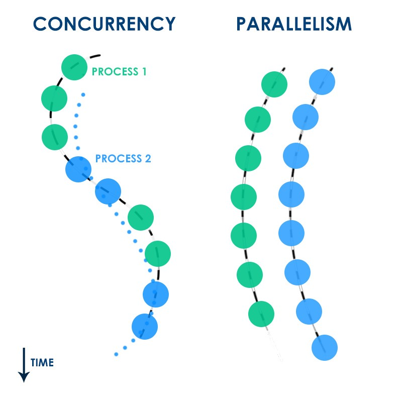
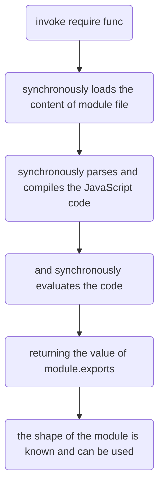
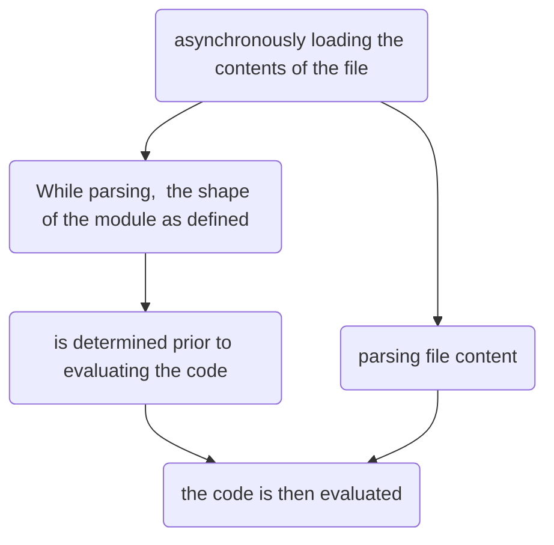

# NodeJS Notes

- [NodeJS Notes](#nodejs-notes)
  - [Install/Uninstall node js on Window](#installuninstall-node-js-on-window)
  - [Using global modules on Window](#using-global-modules-on-window)
  - [What's difference between Concurrency and Parallelism](#whats-difference-between-concurrency-and-parallelism)
  - [Export Module in Node.js](#export-module-in-nodejs)
    - [CommonJS](#commonjs)
    - [ES6 syntax](#es6-syntax)
  - [A little ECMAScript glossary](#a-little-ecmascript-glossary)

## Install/Uninstall node js on Window

**Install node js on Window**

 1. Method 1: Go to
    [https://nodejs.org/en/download/](https://nodejs.org/en/download/)
    to download the lastest version of Node js or the prevous versions
    at the link
    [https://nodejs.org/en/download/releases/](https://nodejs.org/en/download/releases/)
    
 2. Method 2: Install Node via NVM (Node Version Manager)
    [https://danielarancibia.wordpress.com/2017/03/28/install-or-upgrade-nodejs-with-nvm-for-windows/](https://danielarancibia.wordpress.com/2017/03/28/install-or-upgrade-nodejs-with-nvm-for-windows/)


**Uninstall completely from Windows**
1.  Take a deep breath.
    
2.  Run  `npm cache clean --force`
    
3.  Uninstall from Programs & Features with the uninstaller.
    
4.  Reboot (or you probably can get away with killing all node-related processes from Task Manager).
    
5.  Look for these folders and remove them (and their contents) if any still exist. Depending on the version you installed, UAC settings, and CPU architecture, these may or may not exist:
    
    -   `C:\Program Files (x86)\Nodejs`
    -   `C:\Program Files\Nodejs`
    -   `C:\Users\{User}\AppData\Roaming\npm`  (or  `%appdata%\npm`)
    -   `C:\Users\{User}\AppData\Roaming\npm-cache`  (or  `%appdata%\npm-cache`)
    -   `C:\Users\{User}\.npmrc`  (and possibly check for that without the  `.`  prefix too)
    -   `C:\Users\{User}\AppData\Local\Temp\npm-*`
6.  [Check your  `%PATH%`  environment variable](https://stackoverflow.com/questions/141344/how-to-check-if-directory-exists-in-path)  to ensure no references to  `Nodejs`  or  `npm`  exist.
    
7.  If it's  _still_  not uninstalled, type  `where node`  at the command prompt and you'll see where it resides -- delete that (and probably the parent directory) too.
    
8.  Reboot, for good measure.

[https://stackoverflow.com/questions/20711240/how-to-completely-remove-node-js-from-windows](https://stackoverflow.com/questions/20711240/how-to-completely-remove-node-js-from-windows)

## Using global modules on Window

Add an environment variable called `NODE_PATH` and set it to `%USERPROFILE%\Application Data\npm\node_modules` (Windows XP), `%AppData%\npm\node_modules` (Windows 7/8/10), or wherever npm ends up installing the modules on your Windows flavor. To be done with it once and for all, add this as a System variable in the Advanced tab of the System Properties dialog (run `control.exe sysdm.cpl,System,3`).

[https://stackoverflow.com/questions/9587665/nodejs-cannot-find-installed-module-on-windows](https://stackoverflow.com/questions/9587665/nodejs-cannot-find-installed-module-on-windows)
<!--stackedit_data:
eyJoaXN0b3J5IjpbLTEzODA4NDEzNTMsMzExNTcyOTcxXX0=
-->


## What's difference between Concurrency and Parallelism

**Concurrency** in very simple terms means that two or more processes (or threads) run together, *but not at the same time*. Only one process executes at once.

**Parallelism** on the other hand means that the processes (or threads) run in parallel (surprise surprise); meaning they start at the same time and *execute alongside each other at the same time.*



**Reference**

[Node.JS Concurrency with Async/Await and Promises!](https://medium.com/platformer-blog/node-js-concurrency-with-async-await-and-promises-b4c4ae8f4510)


## [Export Module in Node.js](https://www.tutorialsteacher.com/nodejs/nodejs-module-exports)

### CommonJS

The **`module.exports`** or **`exports`** is a special object which is included in every JS file in the Node.js application by default. `module` is a variable that represents current module and `exports` is an object that will be exposed as a module. So, whatever you assign to `module.exports` or `exports`, will be exposed as a module.

**Export Object**

```javascript
module.exports.log = function (msg) { 
    console.log(msg);
};

module.exports.logLevel = "Error";

//or 

module.exports = {
    log: function (msg) { 
        console.log(msg);
    },
    logLevel: "Error"
}

//or using exports object has the same result

exports.log = function (msg) { 
    console.log(msg);
};
```

```javascript
var msg = require('./Log.js');

msg.log('Hello World');

//or

const {log, logLevel} = require('./Log.js');

```

**Export Function**

```javascript
module.exports = function (msg) { 
    console.log(msg);
};

var msg = require('./Log.js');

msg('Hello World');
```

**Export function as a class**

```javascript
module.exports = function (firstName, lastName) {
    this.firstName = firstName;
    this.lastName = lastName;
    this.fullName = function () { 
        return this.firstName + ' ' + this.lastName;
    }
}

var person = require('./Person.js');

var person1 = new person('James', 'Bond');

console.log(person1.fullName());
```
### ES6 syntax

using `export` keyword


```javascript
export function foo() {
  return 'bar';
}
export function bar() {
  return 'foo';
}

//importing
import {foo, bar} from 'foobar';
console.log(foo());
console.log(bar());

```

> The key difference between CommonJS and ES6 is the way to load other module via `require` keyword

In CommonJS



in ES6

>ES6 modules are loaded, resolved and evaluated asynchronously



> The shape of the module as defined sound like that the module's interface is known before implementing of this module is actually loaded

**Reference**

[An Update on ES6 Modules in Node.js](https://medium.com/the-node-js-collection/an-update-on-es6-modules-in-node-js-42c958b890c)

## [A little ECMAScript glossary](https://2ality.com/2011/06/ecmascript.html)

ECMAScript: 

Sun (now Oracle) had a trademark on the name “Java” and therefore also on the name “JavaScript”. That led to Microsoft calling its JavaScript dialect “JScript”. Thus, when it came to finding an official name for the language, “JavaScript” could not be used. “ECMAScript” was chosen, because the corresponding standard is hosted by Ecma International (see below). Usually, the terms “ECMAScript” and “JavaScript” are interchangeable. If JavaScript means “ECMAScript as implemented by Mozilla and others” then ECMAScript is the standard and JavaScript one of its implementations. The term “ECMAScript” is also used to describe language versions: ECMAScript 3, ECMAScript 5, etc.

> ECMAScript versus JavaScript. ECMAScript is the language standard. JavaScript is one implementation, Microsoft’s JScript is another one.
<!--stackedit_data:
eyJoaXN0b3J5IjpbLTY5NjE5MDc2MF19
-->
